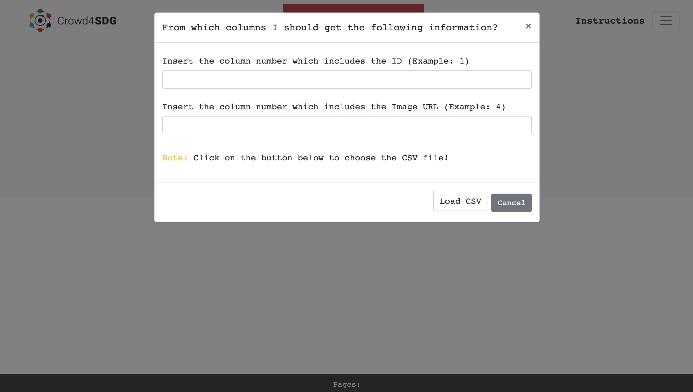

# Visualizer Annotator Project
A subproject of Crowd4SDG project which was developed by Mohammad Ala Amjadi at Politecnico di Milano

## Instructions

### Installing, Running and using

You can whether use this application locally or on the cloud (Heroku).

#### Installing the server

You need a local HTTP server to serve the public folder (index.hml). This can be done using Node, Python, XAMP, WAMP, or any other server.
- Node: [Download](https://nodejs.org/en/download/), for macOS instructions [click here](https://treehouse.github.io/installation-guides/mac/node-mac.html)

    Run the following command inside the application folder where index.js exists:
    ```
    npm install
    ```
- Python: [Download](https://www.python.org/downloads/)

#### Running the application

Running the application on Heroku Cloud: [Click here](https://social-distancing-project.herokuapp.com/)

Running the application locally:

- Node:

    Run the following command inside the application folder where index.js exists:
    ```
    node index.js
    ```
- Python:
    ```
    python -m http.server 8000 --bind 127.0.0.1
    ```

#### Using the application


1) From the right side menu, choose the "New Question" item. Insert the question and possible answers. Use a semicolon to separate your answers and do not use special characters (space can be used). Click on the submit button to save the question and possible answers. Submitting this at any stage of the procedure will reset the application (same as refreshing the page) and everything will be cleared.


2) Before uploading your CSV file you have to define for the application which column numbers (the first column is 1) belong to the ID and image URL. Then by clicking on the "load CSV" button you can choose your CSV file. If you are repeating the same question for multiple CSV files, when you open this module instead of seeing the "load CSV" button you will see the name of the CSV file as the button name.




3) Select the proper answers for each picture. By navigating between different pages. Your progress will be saved in an array and it will not get cleared. If you refresh the page, use the back/forward button or your browser crashes all your answers will get cleared.


4) If you need to choose an option for all of the pictures on the page you can choose the "Check All" item from the menu.


5) When you are done with all of the pictures for one CSV file, you can click on the submit button and download the results in an output CSV file.


6) You can repeat steps 2 to 5 for each input CSV file without refreshing the page, changing the questions and answers.

#### General Notes
- If a picture does not exist, the ID will be added to the output CSV file with "Image Not Found" as an answer.
- If you don't choose any of the options for an image, the ID will be added to the output CSV file with "Did not choose an option" as an answer.
- The output CSV file name would be "QUESTION - INPUT_CSV_FILENAME.csv".
- This application has been tested for CSV files with 50K entries without any problem. Please report any possible bugs or issues you may face.
- Your answers will be saved immediately in an array and you don't need to do anything extra. If you refresh the page, use the back/forward button or your browser crashes all your answers will get cleared.
- The application does not have any problem with CSV files that contains multiple image URLs with having the same ID.
- In case retrieving an image returns error 403 or 404, the ID will be added to the output CSV file with "Image Not Found" as an answer.

#### Troubleshooting
For troubleshooting, it is better to open your browser's inspect element and check the console tab.

##### Repeated buttons
- If you see in your page pictures with repeated buttons (2 or many times) just click on the current page number to refresh the whole pictures and answers. Your answers still will be there.

##### Empty pages
- You might see an empty page, this happens because some websites use gzip for compression and when your browser checks the size of the content (image) it sees the difference and this can lead to a "Failed to load resource: net::ERR_HTTP2_PROTOCOL_ERROR" error. If you open the console tab you will find (sometimes delayed) this error. After receiving this error if you click on the current page number you will get the contents, if not try with different pages and give your browser some seconds to get the errors. Eventually, you don't need to refresh your page but only click on the page numbers.

##### Answers not loading
- Maybe you used unacceptable characters in your answers. You are allowed to use space. Check the console tab for the detailed error message.

##### Pictures not loading
- Maybe you indicated wrongly the URL column.
- The URLs are not working. The substitutes the HTTP with HTTPS in the URLs automatically for preventing CORS errors since the application runs on the cloud we were forced to use HTTPS. You might want to comment out the substitution part and run the application locally.

##### Nothing is loaded (instead of Question)
- Maybe you indicated wrongly the URL column.
- Maybe you indicated wrongly the ID column.
- Your CSV file has different encoding or is corrupted.
- Your device RAM is full and your browser is crashing.
- You have some extensions which block/controls contents.

##### Other
- If we are missing something you can notify us and we will update this documentation.

## License
This resource can be used freely if integrated or build upon in personal projects such as websites, web apps, and web templates intended for personal or academic purposes only. It is not allowed to take the resource "as-is" and sell it, redistribute, re-publish it, or sell "plagiarized" versions of it. Any built using this resource should have a visible mention and link to the original work. Always consider the licenses of all included libraries, scripts, and images used.
