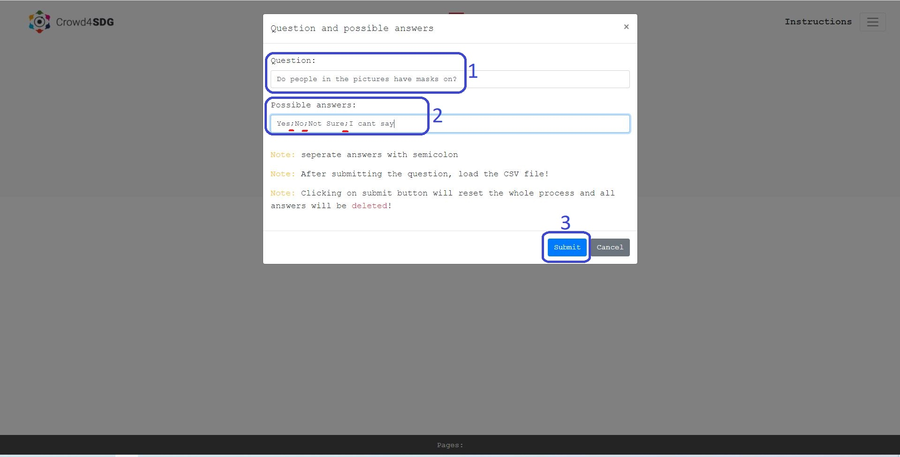
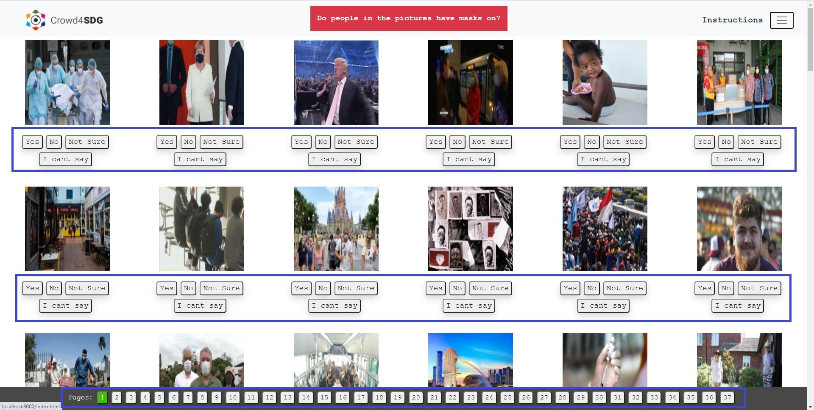
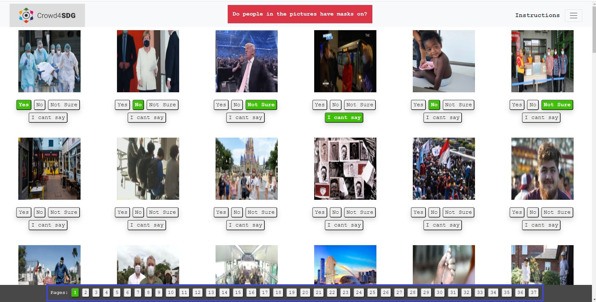

## Instructions
Do you need to use this app locally? <a class="nav-link text-center" href=".././doc" target="_blank">Documentation</a>

#### Using the application

1) From the right side menu, choose the "New Question" item. Insert the question and possible answers (use a semicolon to separate answers. Don't use special characters in the answers but space can be used). Click on the "Submit" button to submit the question and possible answers. Submitting this at any stage will reset the app (same as refreshing the page) and everything will be cleared.

2) Load the input CSV file which contains the Twitter ID and the Image URL.

3) Select the proper answers for each picture. By navigating between different pages your progress will not get cleared.

4) If you need to choose an option for all of the pictures in the page you can chose the "Check All" item from the menu.

5) When you are done with all the pictures for one CSV file, you can download the results output CSV file by clicking on the submit button.

6) You can repeat steps two to four for each input CSV file for the same question.

#### General Notes
- If a picture does not exist, the Twitter ID will be added to the output CSV file with "Image Not Found" as an answer.
- If you don't choose any of the options for an image, the Twitter ID will be added to the output CSV file with "Did not choose an option" as an answer.
- The output CSV file name would be "QUESTION - INPUT_CSV_FILENAME.csv".
- The loading of images for each page might take 2-5 seconds to load, please be patient.
- This app has been tested for CSV files with 10K entries without any problem. Please report any possible bugs and issues you may face.